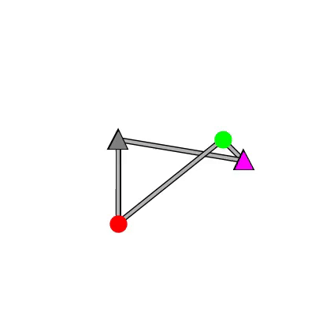
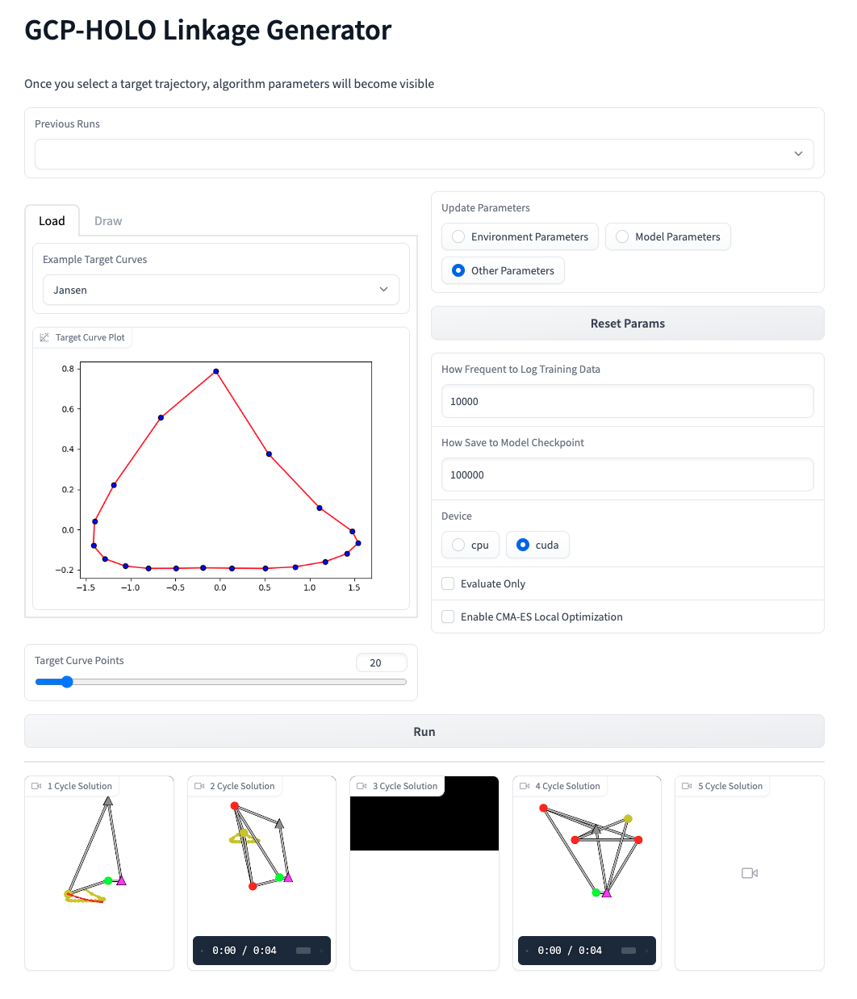

# GCP-HOLO
<p align="center">

</p>

GCP-HOLO is a RL based tree search method for generating high-order linkage graphs that satisfy the path synthesis problem

[Full Paper](https://asmedigitalcollection.asme.org/mechanicaldesign/article/doi/10.1115/1.4062147/1160180/GCP-HOLO-Generating-High-Order-Linkage-Graphs-for)

## Contents
1. [Documentation](#Documentation)
2. [Gradio Interface](#gradio-interface)
3. [Requirements](#requirements)
4. [Example](#example)
5. [Citation](#citation)
6. [License](#license)


## Documentation
[Project Page](https://mfogelson.github.io/gcp_holo/index.html)

**NOTE**: This is still in-progress to provide cleaner and more usable documentation

## Gradio Interface
### (In-Progress)
<p align="center">

</p>


## Requirements
* python>=3.8.0
* stable_baselines3==1.5.0
* torch==1.11.0
* torch_geometric==2.0.4
* gym==0.21.0
* networkx==2.6.2
* cma==3.1.0
* wandb (optional for logging can be commented out if not desired)

### Other packages used
* argparse
* multiprocessing
* pickle
* matplotlib
* numpy 
* itertools
* datetime
* warnings
* time
* copy
* os
* scipy

**NOTE**: No automatic installation due to various computer requirements, please check Cuda and torch versions. Highly recommended to use a conda environment or venv for using the project. 

**WARNING**: This requirement.txt file is there to support the Sphinx Docmunetation and may be missing packagegs

## Example 
Quick Start (Uses Default Args, Not Recommended!):
```
python train.py 
```

Example of various inputs that can be changed:
```
python train.py --goal_filename klann_traj --goal_filepath data/other_curves
```

## Advanced Training Options
```
  -h, --help                        show this help message and exit

  --max_nodes MAX_NODES             Maximum number of revolute joints on linkage graph 
  (default: 11, type: int)

  --resolution RESOLUTION           Resolution of scaffold nodes 
  (default: 11, type: int)

  --bound BOUND                     Bound for linkage graph design [-bound, bound] 
  (default: 1.0, type: float)

  --sample_points SAMPLE_POINTS     Numbder of points to sample the trajectories of revolute joints 
  (default: 20, type: int)

  --feature_points FEATURE_POINTS   Number of feature points for node vector used in GNN 
  (default: 1, type: int)

  --goal_filename GOAL_FILENAME     Goal filename 
  (default: jansen_traj, type: str)

  --goal_path GOAL_PATH             Path to goal file 
  (default: data/other_curves, type: str)

  --use_self_loops                  Add self-loops in adj matrix 
  (default: False, type: None)

  --normalize                       Normalize trajectory for feature vector 
  (default: False, type: None)

  --use_node_type                   Use node type id for feature vector 
  (default: False, type: None)

  --fixed_initial_state             Use same initial design state for all training 
  (default: True, type: None)

  --seed SEED                       Random seed for numpy and gym 
  (default: 123, type: int)

  --ordered                         Get minimum ordered distance 
  (default: True, type: None)

  --body_constraints BODY_CONSTRAINTS  Constraint on Non-coupler revolute joints[xmin, xmax, ymin, ymax] 
  (default: None, type: float)

  --coupler_constraints COUPLER_CONSTRAINTS Constraint on Coupler joint [xmin, xmax, ymin, ymax] 
  (default: None, type: float)

  --use_gnn                         Use GNN feature embedding 
  (default: True, type: None)

  --batch_normalize                 Use batch normalization in GNN 
  (default: True, type: None)

  --model MODEL                     Select which model type to use Models=[DQN, A2C, PPO, random] 
  (default: PPO, type: str)

  --n_envs N_ENVS                   Number of parallel environments to run 
  (default: 1, type: int)

  --checkpoint CHECKPOINT           Load a previous model checkpoint 
  (default: None, type: str)
  
  --update_freq UPDATE_FREQ         How often to update the model 
  (default: 1000, type: int)

  --opt_iter OPT_ITER               How many gradient steps per update 
  (default: 1, type: int)

  --eps_clip EPS_CLIP               PPO epsilon clipping 
  (default: 0.2, type: float)

  --ent_coef ENT_COEF               PPO epsilon clipping 
  (default: 0.01, type: float)

  --gamma GAMMA                     Discount factor 
  (default: 0.99, type: float)

  --lr LR                           Learning rate 
  (default: 0.0001, type: float)

  --batch_size BATCH_SIZE           Batch Size for Dataloader 
  (default: 1000, type: int)

  --buffer_size BUFFER_SIZE         Buffer size for DQN 
  (default: 1000000, type: int)

  --steps STEPS                     The number of steps to train 
  (default: 50000, type: int)

  --num_trials NUM_TRIALS           How many times to run a training of the model 
  (default: 1, type: int)

  --n_eval_episodes N_EVAL_EPISODES The number of epochs to evaluate the model 
  (default: 100, type: int)

  --m_evals M_EVALS                 How many times to run the evaluation with varying seeds 
  (default: 1, type: int)

  --log_freq LOG_FREQ               How often to log training values 
  (default: 1000, type: int)

  --save_freq SAVE_FREQ             How often to save instances of model, buffer and render 
  (default: 10000, type: int)

  --wandb_mode WANDB_MODE           use weights and biases to log information Modes=[online, offline, disabled] 
  (default: online, type: str)

  --wandb_project WANDB_PROJECT     Set weights and biases project name 
  (default: linkage_sb4, type: str)

  --verbose VERBOSE                 verbose from sb3 
  (default: 0)

  --cuda CUDA                       Which GPU to use [cpu, cuda:0, cuda:1, cuda:2, cuda:3] 
  (default: cpu, type: str)

  --no_train                        If you don't want to train 
  (default: False, type: None)

  --cmaes                           Further optimize best designs found with CMA-ES node optimization 
  (default: False, type: None)
```

## Project Tree

```
.
├── data
│   ├── other_curves
│   │   ├── jansen_traj.pkl
│   │   ├── klann_traj.pkl
│   │   ├── strider_traj.pkl
│   │   └── trot_traj.pkl
│   └── test_curves
│       ├── dualloop.pkl
│       ├── eight.pkl
│       ├── hourglass.pkl
│       ├── letterB.pkl
│       ├── moon.pkl
│       ├── outerTrifoil.pkl
│       ├── triangle.pkl
│       └── trifoil.pkl
├── html
│   └── gcp_holo
│       ├── index.html
│       ├── linkage_gym
│       ├── models
│       ├── train.html
│       └── utils
├── __init__.py
├── LICENSE
├── linkage_gym
│   ├── envs
│   │   ├── __init__.py
│   │   └── Mech.py
│   ├── __init__.py
│   └── utils
│       ├── env_utils.py
│       ├── __init__.py
├── models
│   ├── a2c.py
│   ├── dqn.py
│   ├── gcpn.py
│   ├── __init__.py
│   └── random_search.py
├── README.md
├── train.py **(main script)
└── utils
    ├── __init__.py
    └── utils.py
```

## Citation

```
@article{fogelson2023gcp,
  title={GCP-HOLO: Generating High-Order Linkage Graphs for Path Synthesis},
  author={Fogelson, Mitchell B. and Tucker, Conrad and Cagan, Jonathan},
  journal={Journal of Mechanical Design},
  year={2023},
  publisher={American Society of Mechanical Engineers}
}
```

## Liscense
GCP-HOLO is freely available for academic or non-profit organizations' noncommercial research only. Please check [the license file](LICENSE) for further details.
